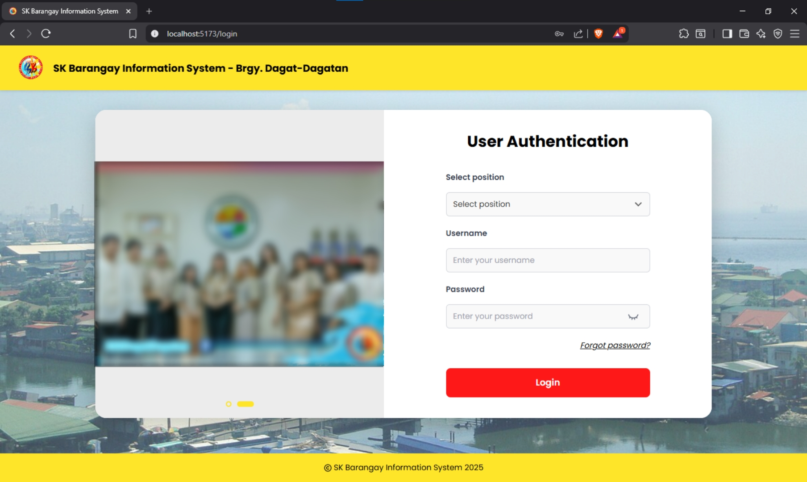
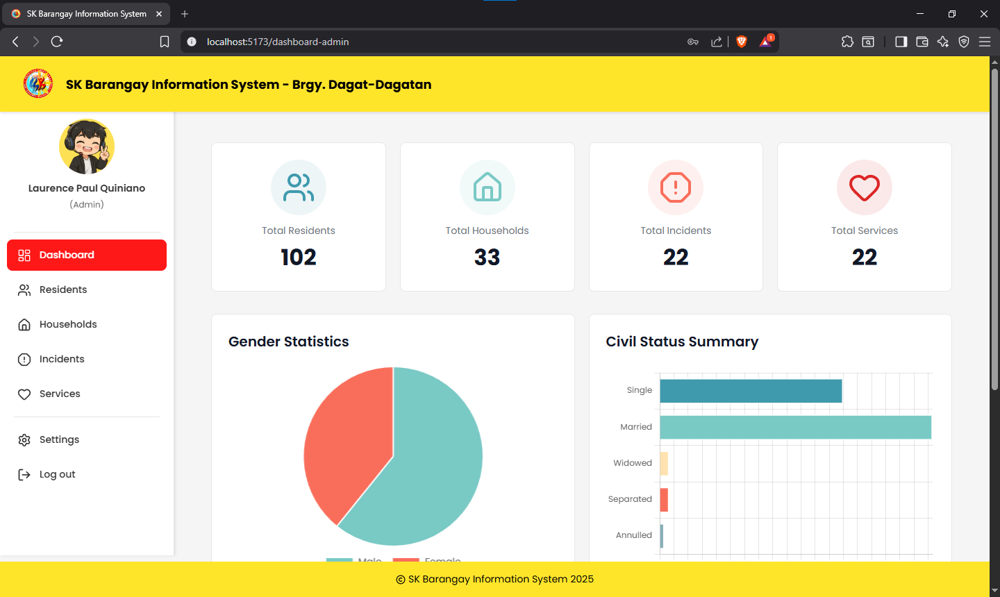

# BrngySystem MNQY — SK Barangay Information System

## System Overview

The **SK Barangay Information System** is a comprehensive web-based management platform designed to digitize and streamline barangay operations. It centralizes essential records and administrative tasks into a secure, user-friendly system that supports efficient governance and transparent service delivery.

The system is built to manage **residents, households, incidents, and barangay services**, while also providing administrative tools such as user activity tracking, time logs, recent activity monitoring, and interface personalization. It is tailored specifically for **Barangay Dagat-Dagatan**, ensuring that daily operations are organized, accurate, and easy to maintain.

---

## Key Features

* Secure user authentication with role-based access (Admin and authorized users)
* Centralized management of residents and household records
* Incident reporting and historical incident tracking
* Barangay services management with beneficiary assignment
* Dashboard analytics and visual statistics
* User login and logout time logging
* Recent activity tracking for accountability
* Interface personalization (colors, logos, backgrounds, carousel images)

---

## Login & User Authentication



The system starts with a secure **User Authentication** module. Users select their assigned position, enter their credentials, and are granted access based on their role. This ensures proper authorization and protection of sensitive barangay data.

**Highlights:**

* Role-based access control
* Secure password-protected login
* Forgot password functionality
* Clean and intuitive login interface

---

## Admin Dashboard Overview



After successful login, administrators are redirected to the **Admin Dashboard**, which serves as the central control panel of the system. It provides real-time summaries and quick access to all major modules.

Dashboard widgets include:

* Total residents
* Total households
* Total incidents
* Total barangay services
* Gender distribution statistics
* Civil status summary charts

These visual insights help administrators quickly assess the current status of the barangay.

---

## Core System Modules

### Residents Management

* Stores complete resident profiles
* Supports demographic and statistical tracking
* Links residents to their respective households

### Households Management

* Maintains household records
* Allows multiple members per household
* Clearly defines household relationships

### Incidents Management

* Records barangay incidents and reports
* Maintains organized incident history
* Supports monitoring and reference

### Services & Beneficiaries

* Manages barangay services and programs
* Tracks beneficiaries per service
* Ensures transparency and proper documentation

---

## Additional Administrative Features

### Interface Personalization

* Customize system colors and themes
* Update logos, headers, and background images
* Manage homepage carousel images

### User Activity & Time Logs

* Records user login and logout timestamps
* Tracks system usage per user
* Improves accountability and security

### Recent Activity Monitoring

* Displays latest system actions
* Assists in auditing and monitoring changes

---

## System Architecture

* **Frontend:** React + Vite
* **Backend:** Node.js with Express
* **Database:** Centralized configuration via backend config files
* **Uploads & Images:**

  * System screenshots: `images/`
  * Personalization images: `backend/uploads/personalisation/images`

---

## Screenshots

### Dashboard Overview


### Login Screen


---

## How to Run the System

### Backend

```bash
cd backend
npm install
node server.js
```

### Frontend

```bash
cd frontend
npm install
npm run dev
```

---

## Purpose and Benefits

The SK Barangay Information System aims to:

* Reduce manual record-keeping
* Improve data accuracy and accessibility
* Enhance transparency and accountability
* Support faster decision-making through visual analytics

This system provides a modern and reliable solution for barangay administration by centralizing data and streamlining operations.

---

© SK Barangay Information System 2025
